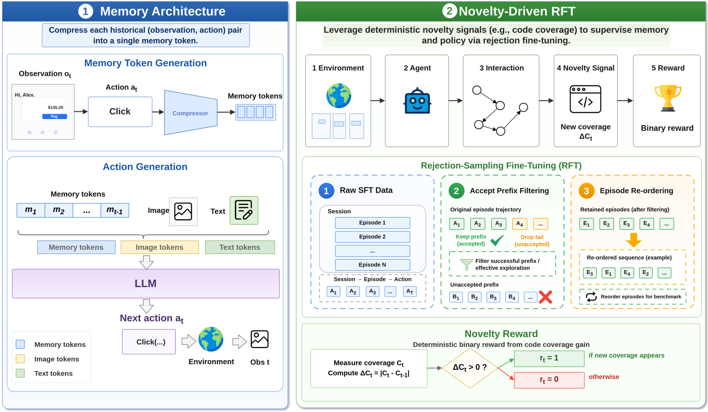

# JAMEL: Joint Agent Memory and Exploration Learning via Novelty Signals

[](https://arxiv.org/abs/2606.01528)
[](https://huggingface.co)
[](https://huggingface.co)



This repository implements the core ideas of [Joint Agent Memory and Exploration Learning via Novelty Signals](https://arxiv.org/abs/2606.01528). In open-ended environments, agents often struggle to explore effectively, especially when external task rewards are sparse or unavailable. A central reason is that effective exploration requires memory. Without remembering what has already been tried, an agent can easily repeat exhausted behaviors instead of discovering new states.

The paper proposes **JAMEL** — **Joint Agent Memory and Exploration Learning** — a framework that trains agent memory and exploration policy together. Its main insight is that memory and exploration form a mutually reinforcing loop: memory helps the agent avoid repeated behaviors and identify unexplored actions, while novelty-driven exploration provides supervision for what the memory should encode. Instead of relying on manually annotated memory labels, JAMEL uses persistent novelty signals, such as JavaScript code coverage in GUI environments, as an intrinsic reward for discovering new behavior. Experiments on the [ScaleWoB](https://github.com/ScaleWoB/ScaleWoB) GUI benchmark show that JAMEL generalizes to unseen applications.

## Quick Start

Create and synchronize the local environment with `uv`:

```bash
git clone https://github.com/MobileLLM/JAMEL.git
cd JAMEL

uv sync --locked --python 3.10 --extra dev --extra train
uv run playwright install chromium
source .venv/bin/activate
```

Install system fonts and the Node.js (18+) coverage tools used by browser evaluation:

```bash
sudo apt-get update
sudo apt-get install -y fontconfig fonts-noto-cjk fonts-noto-color-emoji
fc-cache -fv
npm install -g monocart-coverage-reports monocart-locator
```

Set local paths:

```bash
export JAMEL_ROOT=$PWD
export VERL_AGENT_ROOT=$PWD/third_party/verl-agent
export SCALEWOB_ROOT=$PWD/env/browser_env/scalewob-env
export PYTHONPATH=$JAMEL_ROOT:$VERL_AGENT_ROOT:${PYTHONPATH:-}
```

Download ScaleWoB benchmark:

```bash
python scripts/download_scalewob_env.py
```

You can preview the browser environment now:
```bash
python scripts/serve_scalewob.py
# Open http://127.0.0.1:8000/<app_name>/index.html to browse the benchmark. e.g., http://127.0.0.1:8000/expedia/index.html
```

For training dependencies, install:

```bash
uv pip install -r third_party/verl-agent/requirements.txt
```

### Training

The training entry point is [docs/TRAINING.md](docs/TRAINING.md). Prepare SFT data from trajectories, then train the actor. If `OUTPUT_MODEL_PATH` is set, the trainer packages the final JAMEL model for evaluation automatically.

```bash
python jamel/train/memory/prepare_sft_dataset.py \
  --input /path/to/trajectory.parquet \
  --output data/jamel_sft_data \
  --compressor-model /path/to/Qwen3-VL-2B-Instruct \
  --max-memory-items 512 \
  --max-length 8192 \
  --val-ratio 0.02 \
  --compression-batch-size 4

TRAIN_FILE=data/jamel_sft_data/jamel_memory_sft_train.parquet \
VAL_FILE=data/jamel_sft_data/jamel_memory_sft_val.parquet \
BASE_MODEL_PATH=Qwen/Qwen2.5-VL-7B-Instruct \
COMPRESSOR_MODEL=/path/to/Qwen3-VL-2B-Instruct \
OUTPUT_DIR=outputs/jamel_sft_ckpt \
OUTPUT_MODEL_PATH=outputs/jamel_model \
NPROC_PER_NODE=8 \
TOTAL_EPOCHS=2 \
VAL_STEPS=200 \
bash shell/run_qwen25vl_7b_sft.sh
```


### Evaluation

The evaluation entry point is [docs/EVALUATION.md](docs/EVALUATION.md). Run JAMEL evaluation on 10 test apps:

```bash
MODEL_PATH=/path/to/jamel_model \
APPS_MODE=test10 \
MAX_STEPS=50 \
NUM_SESSIONS=1 \
NUM_GPUS=4 \
WORKERS_PER_GPU=1 \
EVAL_OUTPUT=outputs/eval_test10 \
bash shell/run_eval.sh
```

For more details, please refer to [this document](docs/EVALUATION.md).

### Documentation

- [Training](docs/TRAINING.md)
- [Evaluation](docs/EVALUATION.md)
