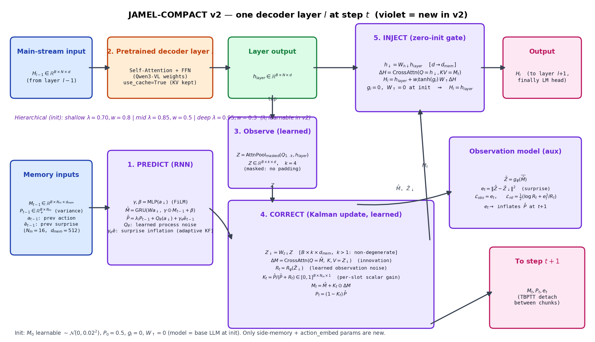
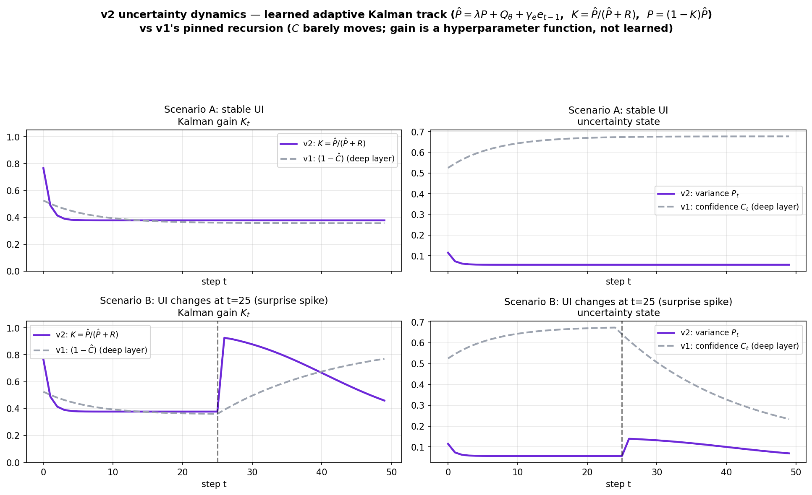
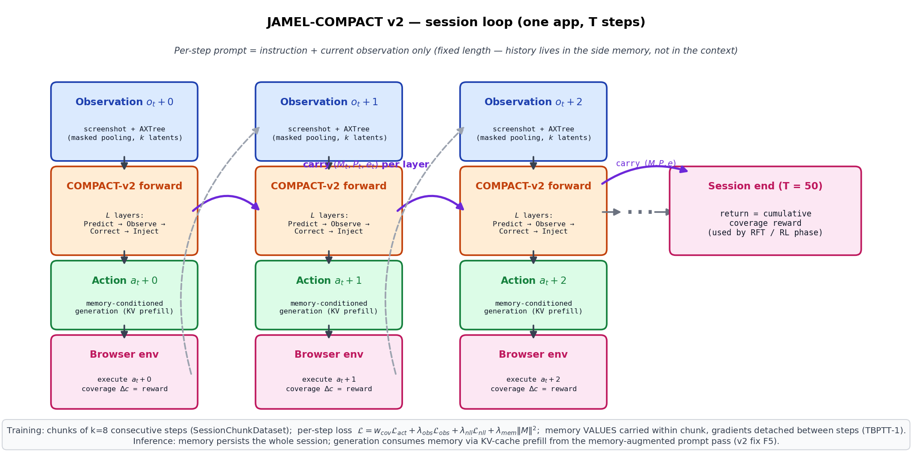

# JAMEL-COMPACT v2 — Method

JAMEL-COMPACT augments a single pretrained vision-language model (Qwen3-VL) with a
small **side memory per decoder layer**, so that one network is both the
**compressor** (writes (observation, action) history into memory) and the
**actor** (reads memory to decide the next action). The context per step stays
fixed — instruction + current observation only — so it never overflows, no matter
how long the session runs.

v2 keeps the three core ideas and fixes the parts of v1 that were mathematically
inert:

1. **Predict–correct loop** that decouples state transition (RNN) from observation
   correction (Kalman update) — now a *proper* adaptive Kalman filter with learned
   noise terms.
2. **Uncertainty-aware memory** — confidence is replaced by a *learned, trainable*
   variance track instead of a pinned recursion.
3. **Unified compressor + actor** — the memory pathway is zero-initialized, so the
   model starts exactly as the pretrained LLM and grows into the memory; inference
   actually *consumes* the memory (v1 discarded it at generation time).

The implementation work order is [COMPACT_V2_IMPLEMENTATION_PLAN.md](COMPACT_V2_IMPLEMENTATION_PLAN.md).

## v1 → v2 at a glance

| Component | v1 | v2 |
|---|---|---|
| Observation $Z_t$ | unmasked mean over all tokens (1 vector, padding included) | masked attention pooling with $k{=}4$ learned latent queries |
| Innovation $\Delta M$ | CrossAttn over 1 KV token → identical across slots (rank-1) | CrossAttn over $k$ tokens → per-slot content |
| Uncertainty state | confidence $C$, fixed recursion $C{=}\lambda C + \alpha(1{-}\lambda C)m$ | variance $P$, learned adaptive KF (see §3) |
| Kalman gain | $\sigma(W[Z;\hat M])\odot(1-\hat C)$, per-element, pinned | $K=\hat P/(\hat P+R)$, per-slot scalar, learned $Q_\theta, R_\psi$ |
| Memory supervision | none (only action CE) | observation-prediction loss $\mathcal{L}_{obs}$ + Gaussian NLL $\mathcal{L}_{nll}$ |
| Injection | fixed weight, random-init projection | zero-init projection + learnable gate (model = base LLM at init) |
| Training unit | single steps, memory reset per sample | session chunks of 8 steps, memory carried (TBPTT-1) |
| Generation at eval | base `llm.generate()` — memory discarded | memory-conditioned via KV-cache prefill |

## 1. Notation

Per decoder layer $l \in \{1,\dots,L\}$ and environment step $t$:

- $H \in \mathbb{R}^{B\times N\times d}$ — main-stream hidden states ($d$ = 1536 for 2B, 4096 for 8B)
- $M_t \in \mathbb{R}^{B\times N_m\times d_{mem}}$ — memory tokens, $N_m{=}16$, $d_{mem}{=}512$
- $P_t \in \mathbb{R}_+^{B\times N_m}$ — per-slot variance (uncertainty), replaces v1's confidence
- $a_{t-1}$ — previous action string; $Z_t \in \mathbb{R}^{B\times k\times d_{mem}}$ — $k{=}4$ observation tokens
- $e_{t-1} \in \mathbb{R}^B$ — previous step's surprise (observation-prediction error)

## 2. The per-layer cycle

### Step 1 — Predict (RNN transition + variance prediction)

The previous action steers the memory transition via FiLM (action = control input
$u_t$ of the state-space model):

$$\gamma,\beta = \mathrm{MLP}(a_\downarrow), \qquad
\hat M_l^t = \mathrm{GRU}\big(W_a\, a_\downarrow,\; \gamma\odot M_l^{t-1}+\beta\big)$$

The variance track predicts its own prior with **learned** process noise, plus an
adaptive term that inflates uncertainty when the previous step was surprising
(adaptive KF):

$$\hat P_l^t = \lambda_l \odot P_l^{t-1} + \mathrm{softplus}(W_q\, a_\downarrow) + \gamma_e\, \bar e_{t-1}$$

$\lambda_l$ is a learnable per-slot vector initialized to the hierarchy
(0.70 shallow / 0.85 mid / 0.95 deep), so shallow layers still forget faster but
can adapt.

### Step 2 — Pretrained layer (unchanged)

$$h_{layer} = \mathrm{DecoderLayer}_l(H_{l-1})$$

The pretrained self-attention + FFN are called in-place; KV cache is kept for
generation (§4).

### Step 3 — Observe (learned masked pooling)

$k$ learned latent queries attend over the non-padding positions of $h_{layer}$:

$$Z_t = \mathrm{AttnPool}_{masked}(Q_{1..k},\; h_{layer}) \in \mathbb{R}^{B\times k\times d},
\qquad Z_\downarrow = W_{z\downarrow} Z_t$$

This replaces v1's "mean over everything including padding" and, because $k>1$,
makes the innovation below non-degenerate.

### Step 4 — Correct (Kalman update, learned)

$$\Delta M = \mathrm{CrossAttn}(Q{=}\hat M,\; K,V{=}Z_\downarrow)
\qquad\text{(innovation, now per-slot)}$$

$$R_t = \mathrm{softplus}\big(\mathrm{MLP}(\bar Z_\downarrow)\big)
\qquad\text{(learned observation noise)}$$

$$K_t = \frac{\hat P}{\hat P + R_t} \in [0,1]^{B\times N_m\times 1}
\qquad\text{(per-slot scalar Kalman gain)}$$

$$M_t = \hat M + K_t\odot \Delta M, \qquad P_t = (1-K_t)\odot \hat P$$

This is the textbook Kalman update: gain is high when the prior is uncertain
($\hat P$ large) or the observation is trustworthy ($R$ small), and the posterior
variance contracts by $(1-K)$. Every quantity is a function of *weights*, so
gradients actually flow — unlike v1's pinned recursion.

**Observation model (auxiliary head):** the memory must learn to *predict* what it
will see — this is what gives "predict" a meaning and defines surprise:

$$\hat Z = g_\phi(\overline{\hat M}), \qquad
e_t = \big\|\hat Z - \bar Z_\downarrow\big\|^2 \quad (\text{surprise})$$

$e_t$ feeds two places: the losses below, and the $\gamma_e \bar e_{t-1}$ inflation
term in Step 1 of the next step (closed adaptive loop).

### Step 5 — Inject (zero-init gated read)

$$H_l = h_{layer} + w_l \tanh(g_l)\cdot W_\uparrow\,
\mathrm{CrossAttn}(Q{=}h_\downarrow,\; K,V{=}M_t)$$

with $g_l = 0$ and $W_\uparrow = 0$ at initialization, so **at step 0 the wrapped
model is exactly the pretrained LLM**; the memory pathway opens only as training
makes it useful. $w_l$ keeps the hierarchy (0.8/0.5/0.3).

## 3. Why the uncertainty now works

Simulation of the exact recursions (deep layer, $\lambda{=}0.9$, $Q{=}0.02$,
$R{=}0.15$, $\gamma_e{=}2$):

- **Stable UI** (top): $K$ settles to a moderate steady state; $P$ contracts to a
  small value — memory trusts itself, observations polish the details.
- **UI change at $t{=}25$** (bottom): the surprise $e$ spikes → $\hat P$ inflates →
  $K$ jumps to ≈0.93 → the new observation overwrites memory → $P$ re-contracts as
  predictions become accurate again.

The dashed gray lines are v1: the gain $(1-\hat C)$ is a function of
hyperparameters, moves in a narrow band, and reacts to the change slowly and
weakly. In v1 the "uncertainty loss" could never drop because $C$ had no learnable
freedom; in v2, $K$ is trainable end-to-end and is supervised by $\mathcal{L}_{nll}$.

## 4. Session loop: training and inference

At every step the agent sees only the instruction and the current observation; all
history lives in $(M_t, P_t)$ carried across steps.

- **Training** uses chunks of 8 consecutive session steps
  (`SessionChunkDataset`). Memory *values* carry forward inside a chunk; gradients
  are detached between steps (TBPTT-1), so each step's loss trains the modules
  against a realistic, evolved memory state. Samples can be weighted by the
  coverage-delta novelty signal already present in the data ($w_{cov}$).
- **Inference** runs one memory-augmented forward over the prompt (updating
  $M, P, e$), hands the resulting per-layer KV cache to the base model's
  `generate()`, and thereby samples actions **conditioned on memory** — fixing
  v1's bypass, where the injected states were discarded.

## 5. Losses

$$\mathcal{L} = w_{cov}\,\mathcal{L}_{act}
+ \lambda_{obs}\,\mathcal{L}_{obs}
+ \lambda_{nll}\,\mathcal{L}_{nll}
+ \lambda_{mem}\,\tfrac{1}{L}\textstyle\sum_l \|M_l\|_2^2$$

- $\mathcal{L}_{act}$ — shifted next-token cross-entropy on response tokens
  (prompt masked to −100). $w_{cov} = 1 + \eta\,\max(\Delta c, 0)$ weights
  high-novelty samples (optional, $\eta{=}0$ = off).
- $\mathcal{L}_{obs} = \frac{1}{L}\sum_l \|\hat Z_l - \bar Z_{\downarrow,l}\|^2$
  — trains the memory to anticipate observations (target detached).
- $\mathcal{L}_{nll} = \frac{1}{L}\sum_l \frac{1}{2}\big(\log R_l + e_l^2 / R_l\big)$
  — Gaussian NLL calibrating the learned observation noise against actual surprise.
- $\lambda_{mem}$ keeps memory magnitudes bounded ($10^{-3}$).

## 6. Initialization and key hyperparameters

| Item | Value |
|---|---|
| Memory | $N_m{=}16$ tokens/layer, $d_{mem}{=}512$, $M_0$ learnable $\sim\mathcal{N}(0, 0.02^2)$ |
| Uncertainty | $P_0 = 0.5$; $\lambda_l$ init 0.70/0.85/0.95 (shallow/mid/deep); $\gamma_e = 1.0$ |
| Observation | $k{=}4$ latent queries |
| Injection | $g_l{=}0$, $W_\uparrow{=}0$; $w_l$ = 0.8/0.5/0.3 |
| Training | chunk 8 steps, TBPTT-1; $\lambda_{obs}{=}0.1$, $\lambda_{nll}{=}0.1$, $\lambda_{mem}{=}10^{-3}$ |
| Parameter overhead | ≈ +12% on Qwen3-VL-2B, ≈ +6% on 8B (same order as v1; U1–U3 add < 1M/layer) |

## 7. Extensions (behind config flags, one at a time)

- **Shared memory across layers** — one memory state, per-layer read/write heads:
  fewer parameters, cross-layer consistency.
- **Two-timescale memory** — fast GRU track + slow EMA track
  $\bar M_t = (1{-}\eta)\bar M_{t-1} + \eta M_t$ for session-level task state.
- **Sparse top-k writes** — update only the $k$ slots with highest gain per step:
  interpretable, less interference.
- **Novelty-driven RL** — after SFT stabilizes: rejection fine-tuning on
  coverage-gaining episodes, then GRPO with coverage-delta reward
  (`third_party/verl-agent`), with memory as part of the rollout state.
